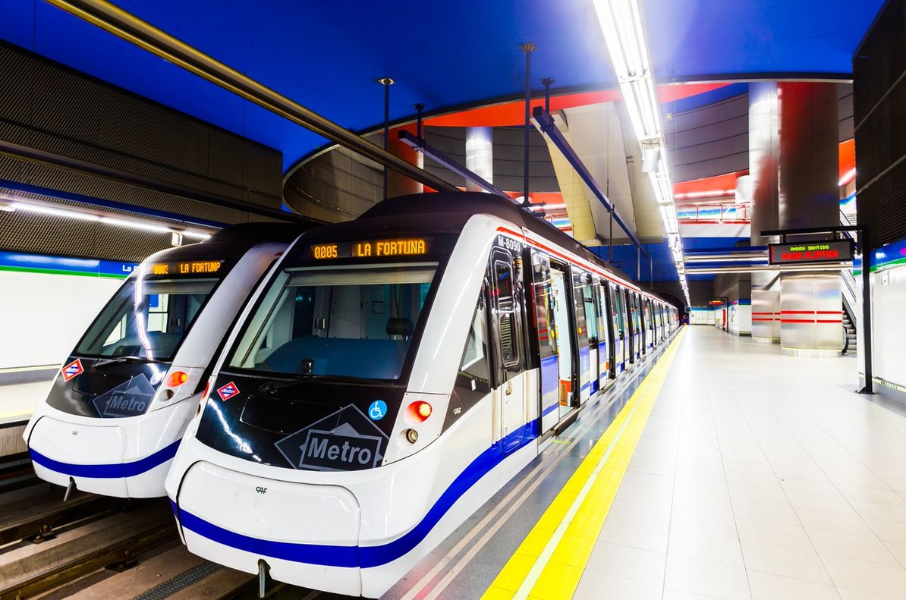

:es: [Spanish version below!](#:es:-Transporte-y-renta:-desigualdad-en-Madrid)

# :uk: / :us: Transport and Income: Inequality in Madrid

## Summary
This project aims to analyse the behaviour on the election of the means of transport by the citizens of the Community of Madrid, studying possible links to their income. Do the citizens with higher income move themselves across the province in a different manner that those with lower income? Can we find any patterns on different socioeconomic conditions?

The main source of data is the [Survey of Movility of 2018](https://datos.comunidad.madrid/dataset/resultados-edm2018), made by Consorcio Regional de Transportes de Madrid (CRTM). From here, data of both the respondents and their trips is extracted and analysed.

The income is a constructed indicator, which is assigned linking the mean income of the known socioeconomic conditions. The data used for this issue is the [Survey of Life Conditions](https://www.madrid.org/iestadis/fijas/estructu/sociales/iecv19.htm), from Madrid's Institue of Statistics.

Finally, there is also a study on whether the weather conditions affect the behaviour of the citizens' trips. All meteorological data is extracted from [AEMET](https://opendata.aemet.es/centrodedescargas/inicio), the Spanish Agency of Meteorology.

The study is focused on **workers'** behaviour on **dry** days and, although most socioeconomic conditions are taken into account, this analysis targets the differences between **men** and **women**.

## Main resources and libraries
The results of the analysis are shown on different media:
+ The [work journal](madrid_transp_renta\work_journal.ipynb), where a comprehensive walkthrough of the project is given.
+ A [presentation](madrid_transp_renta\(ENG TRADUCIR)EDA_Transp_Madrid copy.pdf) where the key information can be found.
+ A [Power BI Dashboard](madrid_transp_renta\dashboard.pbix), which may be used as a fast and interactive way of exploring the main data used by the project.

The versions of the languages and libraries used are:
+ Python: 3.12.5
+ Numpy: 2.1.1
+ Pandas: 2.2.3
+ Matplotlib: 3.9.2
+ Seabornn: 0.13.2

## Hypotheses
The main aim of this project, as presented above, is to prove that **there is a connection between the preferred mode of transport of the citizens and their income** in the Community of Madrid. Some other aspects are tested throughout the study:
+ Higher-income users choose the car as a first transportation option when they go to work.
+ Therefore, lower-income workers use the different modes of public transport.
+ Women use public transport more frequently than men, when going to work.
    + This case is discussed both taken into account their income; and isolating this variable.
+ Weather has little impact on the workers' behaviour when going to work.

## Assumptions
There are some points that have to be taken into account through the analysis:
+ The data by the CRTM is the latest available, but the survey was conducted during 2018.
    + The usage of the whole network covered by CRTM on 2022 was at [85.1 % compared to 2019](https://www.crtm.es/media/4eedagri/informe_anual_2022_eng.pdf), prior to the impact of COVID-19. We assume that the numbers will be already similar and that there hasn't been any deep change on the behaviour of the users because of it.
+ The real income from the users is unknown to us. As it is a constructed indicator (as explained above), it is important to point out:
    + **Income is not wealth**. Wealth is a much more complicated and obscure indicator. We must take into account that this analysis won't cover, for example, citizens with low income but high wealth (which may behave similarly to those with high income or not).
    + The Survey of Life Conditions publishes the **main** income, which is the used data to build said indicator.
    + Four socioeconomic conditions are used for this: **Level of education** (4 categories), **gender**(2), **occupation**(5) and **age**(5). This means the constructed indicator will have a maximum of **200 unique values**.

# :es: Transporte y renta: desigualdad en Madrid

## TEMA
Este proyecto busca arrojar luz sobre los patrones de comportamiento en el transporte de los ciudadanos de la Comunidad de Madrid, estudiando posibles vínculos con su renta. Para ello, se utiliza la [Encuesta de Movilidad del Consorcio Regional](https://datos.comunidad.madrid/dataset/resultados-edm2018) de Transportes de Madrid (CRTM), realizada en el 2018.

Para los cálculos de la renta, se utilizan diferentes tablas extraídas de la [Encuesta de Condiciones de Vida](https://ine.es/dyngs/INEbase/es/operacion.htm?c=Estadistica_C&cid=1254736176807&menu=ultiDatos&idp=1254735976608) del INE, para el año 2018

## HIPÓTESIS
La hipótesis principal de este proyecto es que **existe una relación entre la renta y el uso del transporte en la Comunidad de Madrid**. En concreto, se buscará contrastar:
+ Si las rentas más altas eligen el coche como primera opción para desplazamientos laborales y por placer.
+ Las rentas bajas, para trabajar, utilizan más el transporte público que el coche.
+ Las mujeres utilizan más el transporte público para desplazamientos laborales, sin tener en cuenta la renta.
    + Lo que, unido al segundo punto, explicaría que las mujeres no usan más el transporte público por deseo sino por necesidad.
+ Los hombres utilizan más el transporte públiico para desplazamientos por placer

## SUPUESTOS
Dados los datos utilizados, hemos de tener en cuenta varios puntos:
+ Se está utilizando la última encuesta publicada por el CRTM.
    + Sí se cuentan con los datos de uso del Metro de Madrid, que en 2023 volvieron a niveles pre-pandemia. Por tanto, podemos suponer que no han cambiado las pautas de comportamiento en un nivel agregado
+ No contamos con la renta de los encuestados. Para ello generaremos un dato *proxy*, que estimaremos en función de las condiciones socioeconómicas de los encuestados (edad, ocupación, género, grado de educación, y si cuenta con coche).
    + Renta != Riqueza. Estimaremos la cantidad de **generar** , no de **poseer**. Una persona sin trabajo pero con patrimonio no quedará reflejada en este estudio.
    + Por disponibilidad de los datos, se utilizarán las medias de las rentas. En función de disponibilidad de los datos, es posible que se recoja la media española en lugar de la de la Comunidad de Madrid.
+ Si bien no tiene impacto a primera vista sobre las hipótesis, se realizará un estudio de impacto de la **meteorología** sobre el uso de unos u otros medios transportes.
+ Trataremos todo el transporte público como único conjunto, un estudio más pormenorizado puede encontrar diferencias en este grupo.